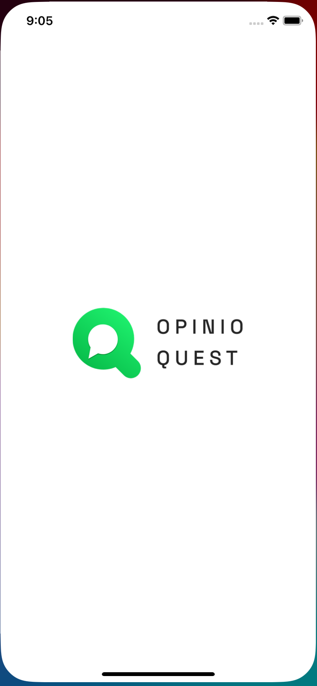

# Opinio Quest Mobile App

This Flutter application allows you to convert websites into mobile applications effortlessly. With the power of Flutter, you can create cross-platform apps for both iOS and Android from any website URL.

## Features

- Convert any website into a mobile application.
- Cross-platform compatibility for iOS and Android.
- Simple and intuitive user interface.
- Offline browsing capability for converted websites.

## Installation

1. Ensure you have Flutter installed. If not, follow the [Flutter installation guide](https://flutter.dev/docs/get-started/install).
2. Clone this repository to your local machine.
3. Navigate to the project directory and run `flutter pub get` to install dependencies.
4. Connect your device or emulator and run `flutter run` to launch the application.

## Usage

1. Launch the application on your device.

## Screenshots

*Screenshot 1: Home Screen*

*Screenshot 

*Screenshot 
